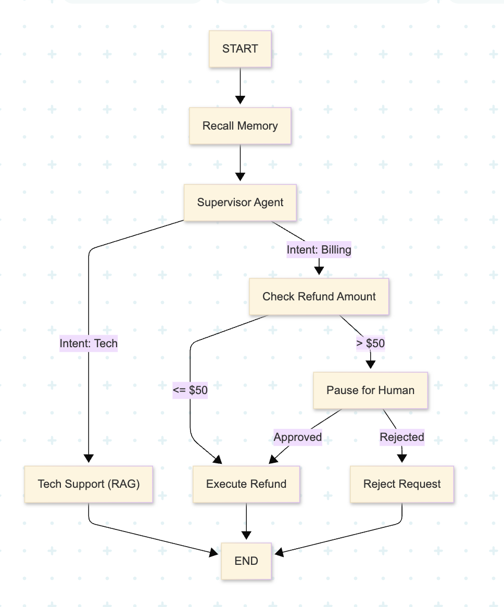

# Enterprise Support Bot (LangGraph) 🤖

A smart, agentic support bot built with **LangGraph** that intelligently routes user queries and manages sensitive workflows like refund approvals using a **Human-in-the-Loop (HITL)** mechanism.

## 🚀 Overview

This project demonstrates a multi-agent architecture where a **Supervisor Agent** routes queries to specialized sub-agents:
*   **Tech Support Agent**: Handles technical questions (e.g., "How do I fix error 505?").
*   **Billing Agent**: Processes refund requests. It includes a safety mechanism where high-value refunds (> $50) trigger a **Human-in-the-Loop** checkpoint for manager approval.

## 📸 Workflow

The following diagram illustrates the graph workflow, including the supervisor routing and the conditional logic for billing approvals:



## ✨ Key Features

*   **Supervisor Routing**: Classifies user intent to direct queries to `Tech` or `Billing` nodes.
*   **Human-in-the-Loop (HITL)**:
    *   **Auto-Approval**: Refunds $\le$ $50 are automatically approved.
    *   **Manager Review**: Refunds > $50 pause the execution graph, requiring manual approval (simulated via CLI input) to proceed.
*   **State Management**: Uses `LangGraph` state to track conversation history, refund amounts, and approval status.
*   **Memory Checkpointing**: Utilizing `MemorySaver` to persist state across graph interruptions.

## 📂 Project Structure

```
enterprise-support-bot/
├── main.py              # Entry point calling different scenarios
├── src/
│   ├── graph.py         # Graph definition (Nodes, Edges, Compilation)
│   ├── nodes.py         # Agent logic (Supervisor, Tech, Billing)
│   ├── state.py         # AgentState definition (Pydantic/TypedDict)
└── README.md
└── workflow.png 
```

## 🛠️ Installation

1.  Clone the repository and navigate to the project folder.
2.  Ensure you have Python installed.
3.  Install the required dependencies:

```bash
pip install langgraph langchain-core pydantic
```

*(Note: You might need additional packages depending on your specific environment, such as `langchain` or `ipython` if you plan to visualize the graph).*

## 🏃 Usage

Run the `main.py` file to see three different scenarios execute in the console:

```bash
python main.py
```

### Scenarios Covered:

1.  **Scenario A (Tech Support)**:
    *   User: "How do I fix error 505?"
    *   Result: Routed to Tech Support -> Mock solution provided.

2.  **Scenario B (Low Refund - Auto Approve)**:
    *   User: "Refund me $10 please."
    *   Result: Routed to Billing -> Amount < $50 -> **Auto-Approved**.

3.  **Scenario C (High Refund - HITL)**:
    *   User: "I need a refund of $900 immediately."
    *   Result: Routed to Billing -> Amount > $50 -> **PAUSED**.
    *   **Action Required**: The console will prompt multiple choice or input.
    *   Simulated Manager: Type `yes` to approve, letting the graph resume and process the refund.

## 🧠 Technical Details

*   **Graph Construction**: Built using `StateGraph` with a defined `AgentState`.
*   **Conditional Edges**: Logic in `graph.py` determines transitions (e.g., `Supervisor` -> `Tech` vs `Billing`).
*   **Interrupts**: The graph is compiled with `interrupt_before=['Manager']`, allowing the system to halt before the manager node executes, facilitating the human review step.
