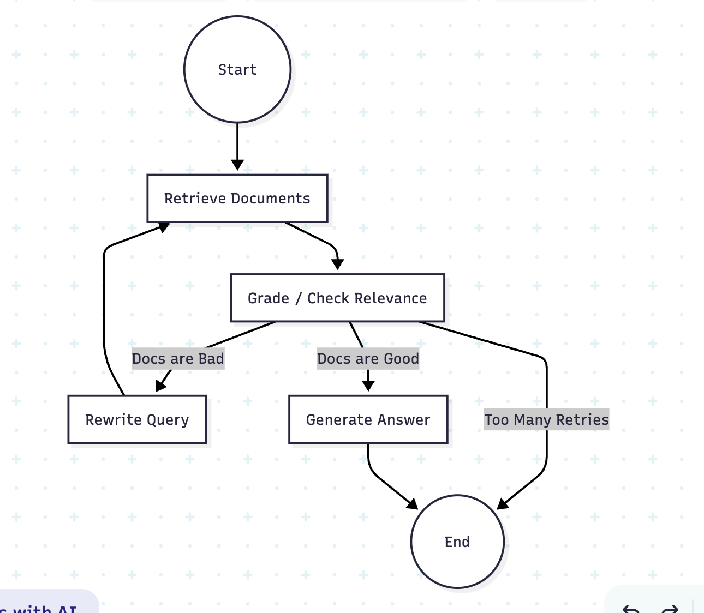

# Project 1: Stateful RAG

This project implements a Stateful Retrieval-Augmented Generation (RAG) workflow using LangGraph. It features a self-correcting mechanism that evaluates retrieved documents and rewrites queries if the documents are not relevant.

## Workflow

The workflow consists of the following steps:
1.  **Retrieve**: Fetches documents based on the current query.
2.  **Grade Documents**: Evaluates the relevance of the retrieved documents.
3.  **Rewrite Query** (Conditional): If documents are irrelevant, the query is rewritten and the process retries (up to 3 times).
4.  **Generate**: Generates the final answer if documents are relevant or max retries are reached.



## Project Structure

-   `src/graph.py`: Defines the LangGraph workflow, nodes, and edges.
-   `src/nodes.py`: Contains the logic for each node (retrieve, grade, rewrite, generate).
-   `src/state.py`: Defines the `AgentState` model.
-   `main.py`: Entry point to run the workflow.

## Setup & Usage

1.  **Install Dependencies**:
    ```bash
    pip install -r requirements.txt
    ```

2.  **Run the Project**:
    ```bash
    python main.py
    ```
